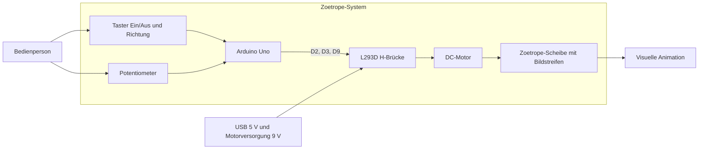
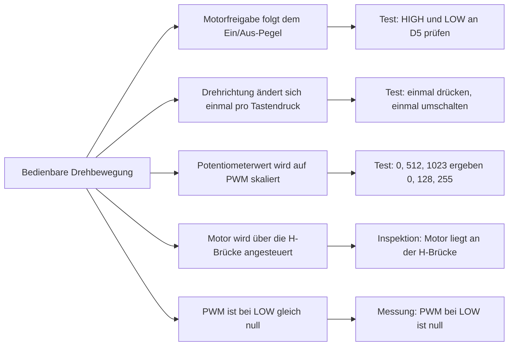
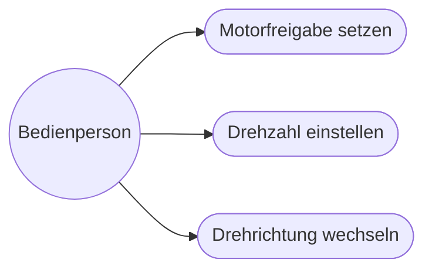
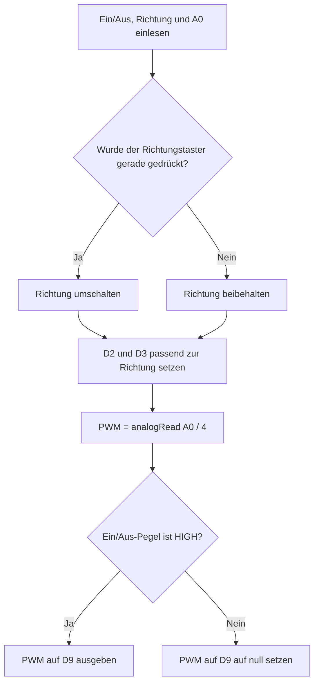
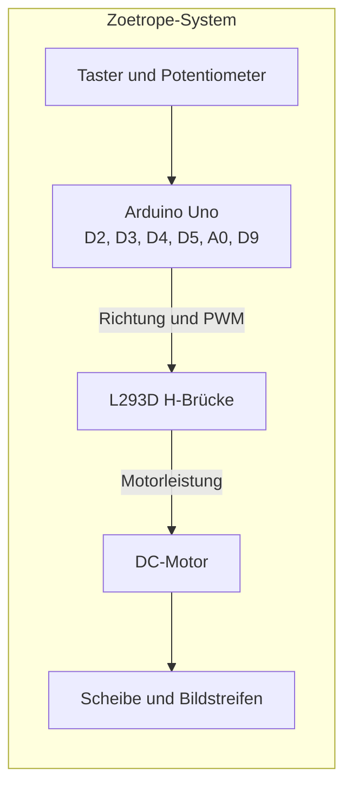
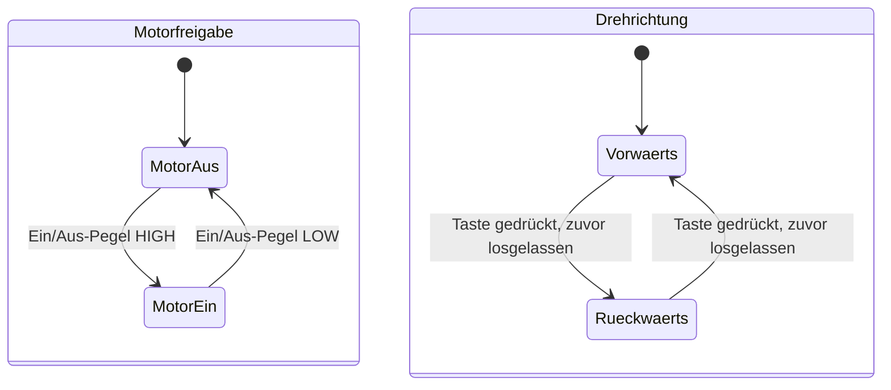

- den einmaligen Richtungswechsel beim Drücken
# Zoetrope SysML-v2-Modell

## Zweck und Baseline

Dieses Dokument führt in sechs verständlichen Diagrammen vom Systemüberblick bis
zu seinen Zuständen. Grundlage ist der Sketch `../project_10_zoetrope.ino`:
Der Motor läuft, solange der Ein/Aus-Taster gedrückt ist. Der Richtungstaster
ändert die Drehrichtung einmal pro Tastendruck; erneutes Drücken ist erst nach
dem Loslassen möglich. Das Potentiometer stellt die Drehzahl ein.

## Lernpfad: sechs Diagramme

Jedes Diagramm beantwortet eine Frage und baut auf dem vorherigen auf. Die
Diagramme sind bewusst vereinfacht und zeigen jeweils nur die Informationen,
die für den aktuellen Lernschritt wichtig sind.

### 1. Systemkontext: Was liegt innerhalb der Systemgrenze?

### 2. Anforderungen: Woran erkennen wir Erfolg?

Jede Anforderung ist mit einer passenden Prüfung verbunden.

### 3. Use Cases: Was tut die Bedienperson mit dem System?

Beim Ein/Aus-Taster ist entscheidend, ob er gerade gedrückt ist. Beim
Richtungstaster löst jeder neue Tastendruck genau einen Wechsel aus. Gedrückt
halten oder Loslassen ändert die Richtung nicht erneut.

### 4. Funktionaler Ablauf: Wie entsteht ein Motorbefehl?

### 5. Struktur: Welche Teile setzen den Ablauf um?

### 6. Zustände: Was bleibt zwischen den Schleifendurchläufen erhalten?

Die beiden Teile zeigen getrennte Zustände. Der Motor kann zum Beispiel
ausgeschaltet und zugleich auf Vorwärtsrichtung eingestellt sein.

## Modell lesen

## Wie die Diagramme zusammenhängen

Der **Systemkontext** zeigt Systemgrenze und Bedienperson. Die **Anforderungen**
beschreiben, woran ein korrektes Ergebnis erkennbar ist. Die **Use Cases**
zeigen die Bedienhandlungen. Der **Ablauf** erklärt, wie der Arduino daraus
Steuersignale bildet. Die **Struktur** ordnet die Aufgaben den Bauteilen zu.
Die **Zustände** zeigen, welche Einstellungen über mehrere Programmdurchläufe
erhalten bleiben.

Die Pinbelegung folgt dem Sketch: D2 und D3 steuern die H-Brücke, D9 gibt das
PWM-Signal aus, D4 und D5 lesen die Taster und A0 liest das Potentiometer.

## Diagramme in VS Code ansehen

Öffne diese README und wähle **Markdown: Open Preview** aus der Befehlspalette
(Tastenkürzel `Cmd+Shift+V`). Die Diagramme erscheinen in der Vorschau direkt
unter ihrer jeweiligen Erklärung.

## Abgrenzung der Quellen

Die Dokumentation folgt dem aktuellen Sketch: Der Ein/Aus-Taster steuert den
Motor über seinen aktuellen Pegel. Die separate PlatformIO-SRS nennt zusätzlich
eine Stroboskop-LED und Synchronisation. Diese Funktionen sind im Sketch nicht
implementiert und deshalb nicht Teil dieser Beschreibung.